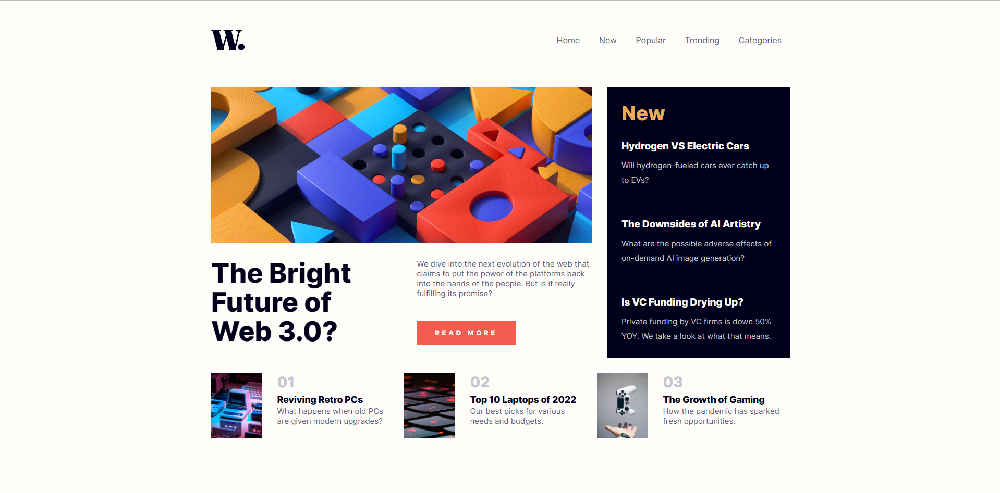
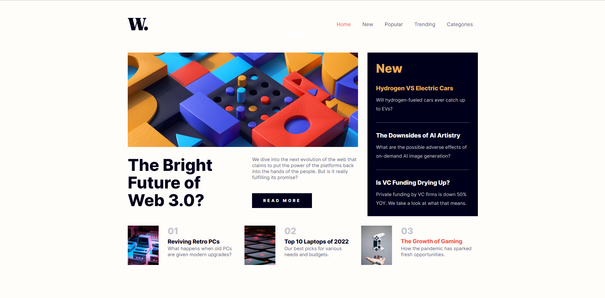
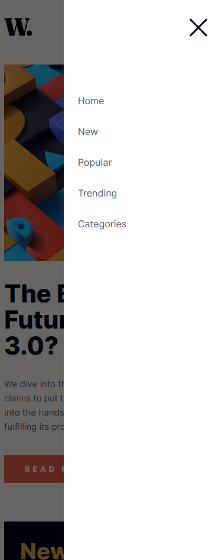

# Frontend Mentor - News homepage solution

This is a solution to the [News homepage challenge on Frontend Mentor](https://www.frontendmentor.io/challenges/news-homepage-H6SWTa1MFl). Frontend Mentor challenges help you improve your coding skills by building realistic projects. 

## Table of contents

- [Overview](#overview)
  - [The challenge](#the-challenge)
  - [Screenshot](#screenshot)
  - [Links](#links)
- [My process](#my-process)
  - [Built with](#built-with)
  - [What I learned](#what-i-learned)
  - [Continued development](#continued-development)
- [Author](#author)

## Overview

### The challenge

Users should be able to:

- View the optimal layout for the interface depending on their device's screen size
- See hover and focus states for all interactive elements on the page

### Screenshot

### Links

- Solution URL: [https://github.com/MoggStephen/news-homepage-main]
- Live Site URL: [https://moggstephen.github.io/news-homepage-main/]

## My process

### Built with

- Semantic HTML5 markup
- Sass
- Flexbox
- CSS Grid
- Desktop-first workflow
- Javascript
- Correct file and folder names / correct class and id naming

### What I learned

- Developing a burger menu ive faced this issue in the past where changing from mobile screenwidth size to dekstop size causes class naming issues. In the past ive simply added the mobile class names outside of the media query and then simply duplicated the css properties of the desktop class name so the element is styled.
- I wanted to find another solution in this webpage so i figured out a way in javascript to change the classnames when the screen width changes from mobile to desktop size.
- I really need to look into how this issue is handled or if it is handled at all by looking into other peoples solutions!
- I dont really use css grid but working with it in this project i have learnt alot and think i need to use it more.

### Continued development

- Use css grid more!
- Figure out how the issue i fixed in the burger menu is commonly handled.

## Author

- Frontend Mentor - [@MoggStephen](https://www.frontendmentor.io/profile/MoggStephen)